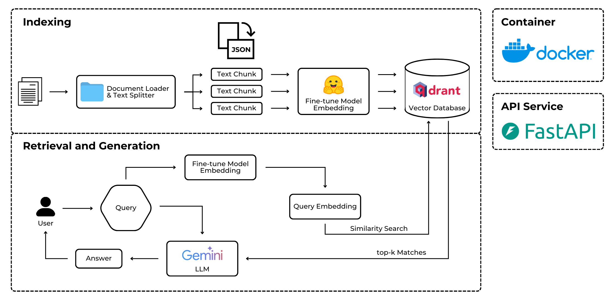
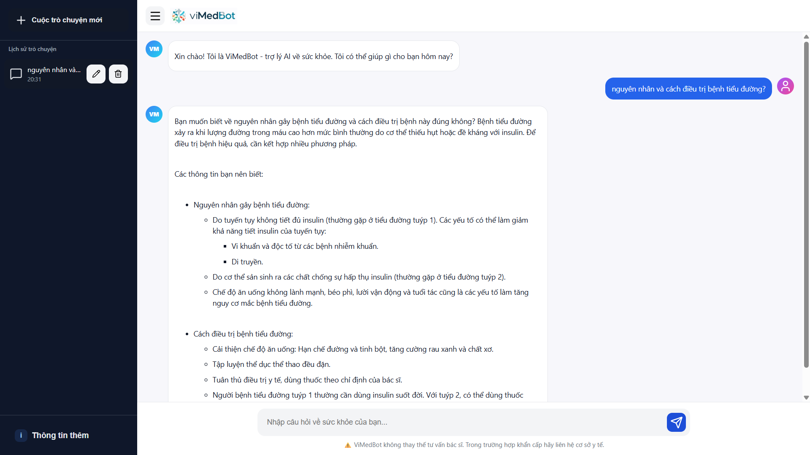

# ViMedBot 🩺

## Description
**ViMedBot** is an intelligent Retrieval-Augmented Generation (RAG) system designed to **provide healthcare consultation for Vietnamese users**. The system leverages cutting-edge natural language processing (NLP) and vector search technologies to deliver accurate, context-aware, and user-friendly answers to medical and health-related queries.

## Demo

## Methodology
### Data Collection & Processing
Dataset [vietnamese-medical-dataset](https://huggingface.co/datasets/mtue29/vietnamese-medical-dataset) is available now. 

At the foundation of the RAG system is a carefully curated knowledge source derived from reliable Vietnamese material(s). The workflow for preparing this data consists of several stages:
- **Data Collection:** Content such as articles, reports, domain-specific knowledge, and other reference texts is automatically collected through web crawlers and API connections to trusted source(s).
- **Data Preprocessing:** The raw text is standardized by removing unnecessary elements (ads, navigation menus, formatting noise) and resolving issues like duplicates or inconsistent characters.
- **Data Organization:** After cleaning, the corpus is segmented into meaningful chunks (sections, paragraphs, or semantic units) with metadata (source, title, publication date) attached, enabling more precise retrieval.
- **Data Storage:** The structured data is embedded into dense vector representations and stored in a vector database (`Qdrant`). This allows semantic search to match user queries against the most relevant passages, ensuring accurate and efficient retrieval for the RAG pipeline.

### Model
The ViMedBot system integrates multiple specialized models to power its RAG pipeline:

#### Language Model (LLM)
- **Model:** `gemini-2.0-flash` (Google Gemini)
- **Purpose:** Generates natural, contextual responses based on retrieved medical documents
- **Features:** Fast inference, multilingual support, optimized for Vietnamese medical terminology

#### Embedding Model
- **Model:** [`Dqdung205/medical_vietnamese_embedding`](https://huggingface.co/Dqdung205/medical_vietnamese_embedding)
- **Purpose:** Converts text into dense vector representations for semantic search
- **Specialization:** Fine-tuned on Vietnamese medical corpus for domain-specific understanding
- **Architecture:** Based on sentence-transformers, optimized for medical terminology

#### Reranker Model
- **Model:** `rerank-multilingual-v3.0` (Cohere)
- **Purpose:** Refines retrieved documents by reordering them based on relevance to the user query
- **Features:** Cross-encoder architecture, multilingual support including Vietnamese
- **Impact:** Significantly improves answer quality by prioritizing the most relevant context

### Deployment

## Installation

## Limitation & Future Works

## Disclaimer ⚠️
ViMedBot is **not a replacement for professional medical advice**. Always consult a qualified doctor or healthcare provider for medical concerns.