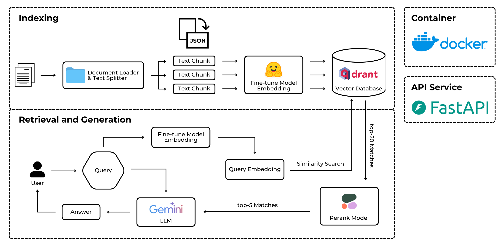

# ViMedBot 🩺

## Description
**ViMedBot** is an intelligent Retrieval-Augmented Generation (RAG) system designed to **provide healthcare consultation for Vietnamese users**. The system leverages cutting-edge natural language processing (NLP) and vector search technologies to deliver accurate, context-aware, and user-friendly answers to medical and health-related queries.



## Demo


## Methodology
### Data Collection & Processing
Dataset [vietnamese-medical-dataset](https://huggingface.co/datasets/mtue29/vietnamese-medical-dataset) is available now. 

At the foundation of the RAG system is a carefully curated knowledge source derived from reliable Vietnamese material(s). The workflow for preparing this data consists of several stages:
- **Data Collection:** Content such as articles, reports, domain-specific knowledge, and other reference texts is automatically collected through web crawlers and API connections to trusted source(s).
- **Data Preprocessing:** The raw text is standardized by removing unnecessary elements (ads, navigation menus, formatting noise) and resolving issues like duplicates or inconsistent characters.
- **Data Organization:** After cleaning, the corpus is segmented into meaningful chunks (sections, paragraphs, or semantic units) with metadata (source, title, publication date) attached, enabling more precise retrieval.
- **Data Storage:** The structured data is embedded into dense vector representations and stored in a vector database (`Qdrant`). This allows semantic search to match user queries against the most relevant passages, ensuring accurate and efficient retrieval for the RAG pipeline.

### Model
The ViMedBot system integrates multiple specialized models to power its RAG pipeline:

#### Language Model (LLM)
- **Model:** `gemini-2.0-flash` (Google Gemini)
- **Purpose:** Generates natural, contextual responses based on retrieved medical documents
- **Features:** Fast inference, multilingual support, optimized for Vietnamese medical terminology

#### Embedding Model
- **Model:** [`Dqdung205/medical_vietnamese_embedding`](https://huggingface.co/Dqdung205/medical_vietnamese_embedding)
- **Purpose:** Converts text into dense vector representations for semantic search
- **Specialization:** Fine-tuned on Vietnamese medical corpus for domain-specific understanding
- **Architecture:** Based on sentence-transformers, optimized for medical terminology

#### Reranker Model
- **Model:** `rerank-multilingual-v3.0` (Cohere)
- **Purpose:** Refines retrieved documents by reordering them based on relevance to the user query
- **Features:** Cross-encoder architecture, multilingual support including Vietnamese
- **Impact:** Significantly improves answer quality by prioritizing the most relevant context

### Deployment
ViMedBot is a comprehensive medical advisory chatbot leveraging modern technologies for efficient Retrieval-Augmented Generation (RAG) in healthcare. Its architecture comprises the following core components:
- **Backend:** A robust FastAPI server processes incoming API requests, orchestrates the RAG pipeline, and integrates embedding models, vector database retrieval, and LLM inference for accurate responses.
- **Vector Database:** Qdrant is utilized for high-performance similarity searches, enabling quick and relevant retrieval of medical documents and knowledge bases.
- **Frontend:** Streamlit delivers a user-friendly web interface with an interactive chat format, facilitating seamless healthcare consultations and consultations for users.
- **Infrastructure:** Docker containers encapsulate the entire stack, promoting reliable and reproducible deployments from development to production environments.
- **API Integration:** RESTful APIs facilitate smooth interactions among the frontend, backend, external model services, and other integrations, ensuring end-to-end efficiency.

## Installation
**1. Clone repository**
```bash
git clone https://github.com/mtue04/ViMedBot-HoiDapSucKhoeAI.git
cd ViMedBot-HoiDapSucKhoeAI
```

**2. Create virtual environment**
```bash
# Using conda
conda create -n vimedbot 
conda activate vimedbot
pip install -r requirements.txt

# OR using venv
python -m venv vimedbot
source vimedbot/bin/activate 
pip install -r requirements.txt
```

**3. Configure environment variables**
```bash
cp `.env.example` `.env`
```
Then, edit `.env` with your API keys.

**4. Setup Qdrant vector db**
- S1: Sign up at [cloud.qdrant.io](cloud.qdrant.io)
- S2: Create a free cluster (1GB storage)
- S3: Copy URL and API key to `.env`

**5. Run app**
```bash
# Development mode (auto-reload)
python -m uvicorn main:app --reload --host 0.0.0.0 --port 8000

# Production mode
python -m uvicorn main:app --host 0.0.0.0 --port 8000 --workers 4
```
Visit: http://localhost:8000

## Future Works
**Custom Vietnamese Medical Embedding Model**
- **Objective:** Replace `Dqdung205/medical_vietnamese_embedding` with a own finetuned model
- **Approach:**
    - Fine-tune multilingual models on Vietnamese medical corpus
    - Use contrastive learning with medical Q&A pairs
    - Distill to smaller model for faster inference

**Agentic RAG System:** Transform from simple RAG into Agentic RAG with specialized agents

**Multi-Modal Input**
- **Image Upload:** Analyze skin rashes, wound photos, medical reports
- **Voice Input:** Vietnamese speech-to-text for accessibility
- **Integration:** `CLIP` for image-text alignment, `Whisper` for STT

## Disclaimer ⚠️
ViMedBot is **not a replacement for professional medical advice**. Always consult a qualified doctor or healthcare provider for medical concerns.